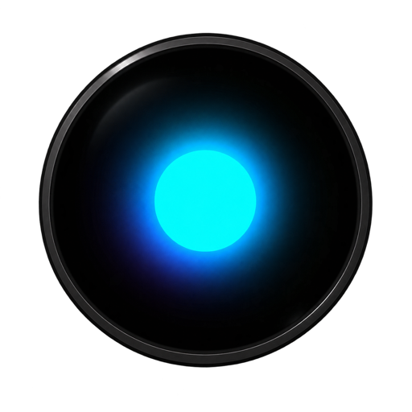
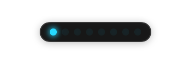
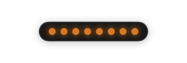
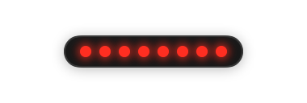
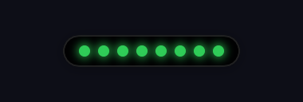
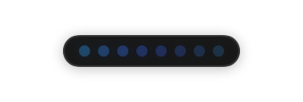
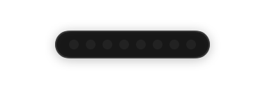

<p align="center">
  
</p>

<h1 align="center">AI Pulse</h1>

<p align="center">
  <b><a href="https://aipulse.leog.me">aipulse.leog.me</a></b> — website &amp; download
</p>

<p align="center">
  <a href="https://www.producthunt.com/products/ai-pulse-2?embed=true&amp;utm_source=badge-featured&amp;utm_medium=badge&amp;utm_campaign=badge-ai-pulse-2" target="_blank" rel="noopener noreferrer"></a>
</p>

<p align="center">
  
</p>

<p align="center">
  
  <br />
  <sub>Where it lives: the unused space beside the Dock — here on the right, streaking cyan while an agent works.</sub>
</p>

An ambient macOS light strip for AI coding agents, inspired by the
[SidePulse](https://sidepulse.io/) hardware gadget — but as an app. A slim strip of eight virtual
LEDs floats in the unused space beside the Dock and shows, with a single
aggregate signal and no per-model distinction, whether anything is running,
waiting for you, finished, or broken:

<table align="center">
  <tr>
    <td align="center"><br /><sub><b>Working</b> — a cyan comet streaks while an agent runs</sub></td>
    <td align="center"><br /><sub><b>Needs you</b> — breathes orange when an agent waits for input or approval</sub></td>
    <td align="center"><br /><sub><b>Failed</b> — double-blinks red when a session breaks</sub></td>
  </tr>
  <tr>
    <td align="center"><br /><sub><b>Finished</b> — all eight settle to solid green</sub></td>
    <td align="center"><br /><sub><b>Idle</b> — a slow aurora drifts while sessions sit quiet</sub></td>
    <td align="center"><br /><sub><b>Off</b> — dark when nothing is connected</sub></td>
  </tr>
</table>

Reduce Motion replaces every animation with a static treatment. The
original per-agent icon pill remains available via Settings → Appearance →
Indicator style.

AI Pulse is **not** embedded in the Dock — macOS exposes no public API for
Dock accessories. It is a Dock-adjacent, borderless, nonactivating `NSPanel`
positioned from public screen geometry (`NSScreen.frame` vs `visibleFrame`).
No private APIs, no Accessibility/Screen Recording permissions, no injection.

## Install

Grab `AI-Pulse-<version>.zip` from the
[latest release](https://github.com/leog/ai-pulse/releases/latest), unzip,
move `AI Pulse.app` to `/Applications`, and launch. Releases are not yet
notarized, so on first launch right-click the app → **Open** (on macOS 15+,
also allow it under **System Settings → Privacy & Security → Open Anyway**).
The `aipulse` CLI ships inside the bundle at
`AI Pulse.app/Contents/Helpers/aipulse`.

Releases are cut automatically when a PR merges: patch by default, minor or
major when the PR carries a `release:minor` / `release:major` label.

## Requirements (building from source)

- macOS 14+
- Xcode 16+ / Swift 6 toolchain

## Build, test, run

```sh
swift build                         # build everything (app, CLI, kit)
swift test                          # unit + integration tests (AIPulseKit)
swift run AIPulseApp                 # launch the pill (accessory app: no Dock icon)
swift run AIPulseApp --snapshot DIR  # render pill + hover card PNGs headlessly and exit
swift run aipulse health             # CLI: check the local event service
./Scripts/make-app.sh               # assemble + sign dist/AI Pulse.app
./Scripts/make-gifs.sh              # regenerate docs/ GIFs from headless frames (needs ffmpeg)
```

`docs/pulse-social.gif` is a larger, captioned cut of the same state cycle,
made for sharing.

For day-to-day use, run the bundled app rather than the bare binary: the
script signs it with your Apple Development identity, giving a stable code
signature so the Keychain trusts the app across rebuilds (bare `swift run`
binaries are ad-hoc signed and trigger a Keychain consent prompt after
every rebuild — that is also why `AIPULSE_DEV_EPHEMERAL_TOKEN=1` exists for
dev loops). The CLI is embedded at `AI Pulse.app/Contents/Helpers/aipulse`.

(The app product is `AIPulseApp` because `AIPulse` and the `aipulse` CLI would
collide on case-insensitive filesystems.)

## Publishing agent status

AI Pulse listens on `127.0.0.1:7455` (configurable in Settings). On launch it
stores a bearer token in the Keychain and writes `~/Library/Application
Support/AIPulse/cli.json` (mode 0600) so the `aipulse` CLI authenticates
without tokens ever appearing in shell commands:

```sh
aipulse agent upsert \
  --id "claude-code:$PWD:$SESSION_ID" \
  --name "Claude Code" --provider anthropic \
  --instance "$(basename "$PWD")" \
  --state working --message "Implementing Dock placement"

aipulse agent update \
  --id "claude-code:$PWD:$SESSION_ID" \
  --state waitingForInput --message "Waiting for permission" --sequence 2

aipulse agent remove --id "claude-code:$PWD:$SESSION_ID"
aipulse agents        # list everything the pill knows
```

Endpoints: `POST /v1/agents/upsert`, `POST /v1/agents/{id}/event`,
`DELETE /v1/agents/{id}`, `GET /v1/agents`, `GET /v1/health` (health is the
only unauthenticated route). The server binds to the loopback interface
only, caps request sizes, validates every payload (`AgentReducer` +
`RequestValidator`), rejects unsafe URL schemes, and never executes
anything received in an event.

Dev note: rebuilding the app changes its ad-hoc code signature, so Keychain
reads re-prompt per build; launch with `AIPULSE_DEV_EPHEMERAL_TOKEN=1` during
development to skip the Keychain and use a per-run token instead.

Quit via the pill's right-click menu → **Quit AI Pulse** (or kill the process).

## Structure

- `Sources/AIPulseKit` — AppKit-free, fully unit-tested core:
  - `Domain/` — `Agent`, `AgentState`, `AgentAction` (typed safe actions +
    URL scheme allowlist), `AgentEventPayload` (wire model),
    `AgentIntegrationLevel`, `StatusPriority` (urgency sort).
  - `Store/AgentStore` — single source of truth; all surfaces render from it.
  - `Placement/` — `ScreenSnapshot`, best-effort `DockGeometry` inference,
    pure `PlacementPolicy` (gutter → adjacent → corner fallbacks, clamping).
- `Sources/AIPulse` — the app:
  - `Presentation/Pill/` — nonactivating `AIPulsePanel`, SwiftUI capsule,
    per-state icons (glyph + badge + ring, never color alone), hover card.
  - `Presentation/AgentList/`, `Presentation/Settings/` — conventional
    keyboard-accessible windows.
  - `Placement/DockPlacementController` — debounced screen-change
    observation; no polling.

## Status

The MVP is complete — all six milestones shipped (pill UI, Dock placement,
event normalization + persistence, the loopback HTTP service + `aipulse`
CLI, the Claude Code adapter, and the optional Dock icon), followed by the
pivot to the lights-first presentation (`LightAggregator` +
`LightStripView`), keeping the icon pill as an option. Remaining and
follow-up work is tracked in
[GitHub issues](https://github.com/leog/ai-pulse/issues).

## pi integration

This repository ships `pi/aipulse-pi.ts`, a pi extension that mirrors the
active pi session onto the light strip exactly like the Claude Code
integration — same loopback API, no changes to AI Pulse needed. See
[pi/README.md](pi/README.md) for the event mapping and install steps
(copy the extension to `~/.pi/agent/extensions/` and `/reload`).

## Claude Code integration

This repository ships `.claude/settings.json` registering `aipulse
claude-hook` for the relevant hook events (via the debug build path), so
Claude Code sessions in this repo appear in the pill automatically once the
app is running. For system-wide use:

```sh
swift build -c release
sudo cp .build/release/aipulse /usr/local/bin/
```

then register the same hooks in `~/.claude/settings.json`, replacing the
command with plain `aipulse claude-hook`. Claude Code asks you to approve
project hooks the first time it loads them.

## Privacy

AI Pulse displays status sent by local agent integrations. It does not read
prompts, terminal contents, editor contents, or application windows.

## Contributing

Contributions are welcome — see [CONTRIBUTING.md](CONTRIBUTING.md) for the
project's design principles, testing expectations, and how to add a new
agent integration. [docs/DEBUGGING.md](docs/DEBUGGING.md) covers the
debugging surface: environment variables, headless snapshots, log
streaming, on-disk state, and fixes for the common failure modes.

## License

[MIT](LICENSE)
